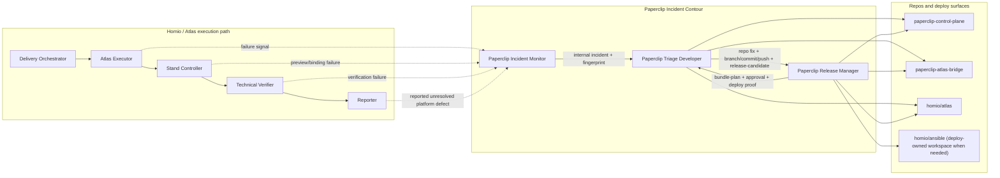

# Paperclip Incident Contour Architecture

## Goal

Make `Paperclip` the native cloud control plane for incident repair across:

- `paperclip-control-plane`
- `paperclip-atlas-bridge`
- `homio/atlas`

The target loop is:

1. detect a real failure while Atlas/Paperclip work is running
2. create an internal Paperclip incident
3. route the incident to the correct repo
4. fix code natively through `codex_local` inside Paperclip
5. push the fix from the Paperclip runtime
6. gate release inside Paperclip
7. wait for deploy proof
8. verify and close the internal incident

This contour replaces the old "local Codex on the Mac fixes and releases it" path.

## Boundary

Two adjacent systems must stay separate:

### 1. Homio Atlas execution path

This remains the normal path for:

- task execution on Atlas stands
- `homio/core` implementation work through Atlas
- preview and stand lifecycle
- verifier evidence from Atlas runs

Normal chain:

- `Delivery Orchestrator`
- `Atlas Executor`
- `Stand Controller`
- `Technical Verifier`
- `Reporter`

### 2. Paperclip Incident Contour

This exists for platform incidents discovered during or around that execution:

- `Paperclip` runtime, routing, issue flow, managed instructions, release control
- `paperclip-atlas-bridge` launch/follow-up/projection/plugin behavior
- `homio/atlas` repo code, mini-app, dispatcher, verifier, artifact serving, Atlas repo deploy path

Normal chain:

- `Paperclip Incident Monitor`
- `Paperclip Triage Developer`
- `Paperclip Release Manager`

Critical rule:

- Atlas execution may provide the source signal.
- Incident repair still happens in a separate internal Paperclip issue.
- Repo edits for this contour happen through Paperclip-native `codex_local`, not through the Atlas adapter.

## System Diagram

## Workspace Model

The contour should live in one Paperclip project with repo workspaces for:

- `paperclip-control-plane`
- `paperclip-atlas-bridge`
- `homio/atlas`

Recommended deploy-owned extension:

- `homio/ansible`

Execution workspace policy is part of the architecture, not an optional UX setting:

- instance experimental `enableIsolatedWorkspaces` must be enabled
- project execution workspaces must default to `isolated_workspace`
- repo checkouts should use `git_worktree` off `origin/main`

Without isolated execution workspaces, incident branches leak into each other on the shared checkout and invalidate remediation proof.

The first three workspaces are required for repo diagnosis and code repair.

The `homio/ansible` workspace is recommended for `Paperclip Release Manager` when full in-contour deploy is required for `paperclip-control-plane` or other rollout paths that still depend on Ansible-owned infrastructure logic.

## Role Contracts

### `Paperclip Incident Monitor`

Owns deterministic first-pass detection.

Contract:

- detect only concrete red flags
- deduplicate by `incident-fingerprint`
- create one internal Paperclip issue per distinct failure
- keep Atlas/Homio external issues as source references only
- assign actionable incidents to `Paperclip Triage Developer`
- once an internal incident exists, refresh evidence documents without stealing ownership back from engineering or release

Runtime:

- prefer `process` adapter
- no full `codex_local` polling on healthy heartbeats

Artifacts:

- issue description
- `incident-fingerprint`
- `source-reference`

### `Paperclip Triage Developer`

Owns diagnosis and repo edits.

Contract:

- decide whether the bug belongs to `Paperclip`, `paperclip-atlas-bridge`, or `homio/atlas`
- fix code from inside Paperclip runtime
- create branch, commit, push, and MR when needed
- keep one bug per branch/commit unless a combined fix is explicit
- write `release-candidate` before release handoff

Runtime:

- `codex_local`
- repo edits happen inside Paperclip workspaces

Artifacts:

- status comment in Russian
- branch name
- commit sha
- MR URL or status
- `release-candidate`

### `Paperclip Release Manager`

Owns bundling, approval, deploy, and release audit trail.

Contract:

- collect ready `release-candidate` entries
- maintain one open bundle per deploy scope
- wait for explicit manual approval
- execute the allowed deploy path from inside the contour whenever possible
- treat external runner failures as separate delivery-substrate incidents

Artifacts:

- bundle issue
- `bundle-plan`
- approval comment
- deploy proof comment

## Module Contracts

### Paperclip -> Bridge

`Paperclip` is the control plane.

`paperclip-atlas-bridge` owns:

- launch/follow-up plugin actions
- Atlas projection into Paperclip issues, comments, and documents
- issue execution envelope and debug pack shaping

Contract:

- bridge should surface execution facts and actionable failure classes
- bridge should not become the long-term owner of deploy approval or release buffering

### Bridge -> Atlas

`homio/atlas` is the execution state owner for:

- A2A task execution
- preview links
- verifier artifacts
- workspace leases
- dispatcher/runtime behavior

Contract:

- Atlas exposes execution evidence
- bridge mirrors it into Paperclip
- incident contour consumes those facts and decides whether a platform incident exists

### Incident Contour -> Atlas execution path

When a failure is discovered while Atlas execution is working:

- keep the external or user-facing issue readable
- create a separate internal incident
- fix the correct repo through the contour
- return final status to the source thread only when a human asks or when closure must be mirrored

## Failure Classification

Use stable failure ownership, not the first noisy symptom.

Route to `Paperclip` when the failure is primarily:

- issue/routing/orchestration
- managed instructions or run behavior
- control-plane release logic

Route to `paperclip-atlas-bridge` when the failure is primarily:

- launch/follow-up action behavior
- projection drift
- plugin/runtime integration
- issue activity/document sync

Route to `homio/atlas` when the failure is primarily:

- mini-app routes
- dispatcher/runtime execution
- verifier/public artifact serving
- Atlas repo deploy behavior

Open a separate delivery-substrate incident when:

- repo fix is ready
- release tuple is correct
- deploy fails because CI runner, SSH reachability, or runner-local env/secrets are broken

## Release Contract

The canonical contour release flow is:

1. internal incident becomes actionable
2. `Paperclip Triage Developer` pushes a repo fix
3. issue gets `release-candidate`
4. `Paperclip Release Manager` builds or updates the scope bundle
5. human leaves `Апрув на деплой.` or `Approve deploy.`
6. release manager deploys through the contour
7. deploy proof is recorded
8. verification result is attached
9. issue moves toward closure

Current approval gate is comment-based, because Paperclip does not yet expose a dedicated deploy approval type.

## Proof Of Completion

The contour is only considered proven when all of the following are visible in Paperclip evidence:

- source signal exists
- separate internal incident exists
- repo routing decision is explicit
- branch/commit/push happened from a Paperclip workspace
- `release-candidate` exists
- `release-candidate` names the exact verify target, proof kind, and restored behavior for the affected scope
- bundle issue and approval exist
- deploy proof exists
- verification evidence exists and matches that exact verify target
- internal incident closes without relying on a local developer laptop

## Companion Docs

- `docs/paperclip-incident-contour-validation-scenario.md`
- `docs/paperclip-incident-contour-five-incident-pack.md`
- `docs/paperclip-incident-bundled-release-flow.md`
- `docs/paperclip-multirepo-internal-project.md`
- `../paperclip-atlas-bridge/docs/paperclip-incident-contour-bridge-contract.md`
- `../Homio/atlas/docs/paperclip-incident-contour-atlas-contract.md`
